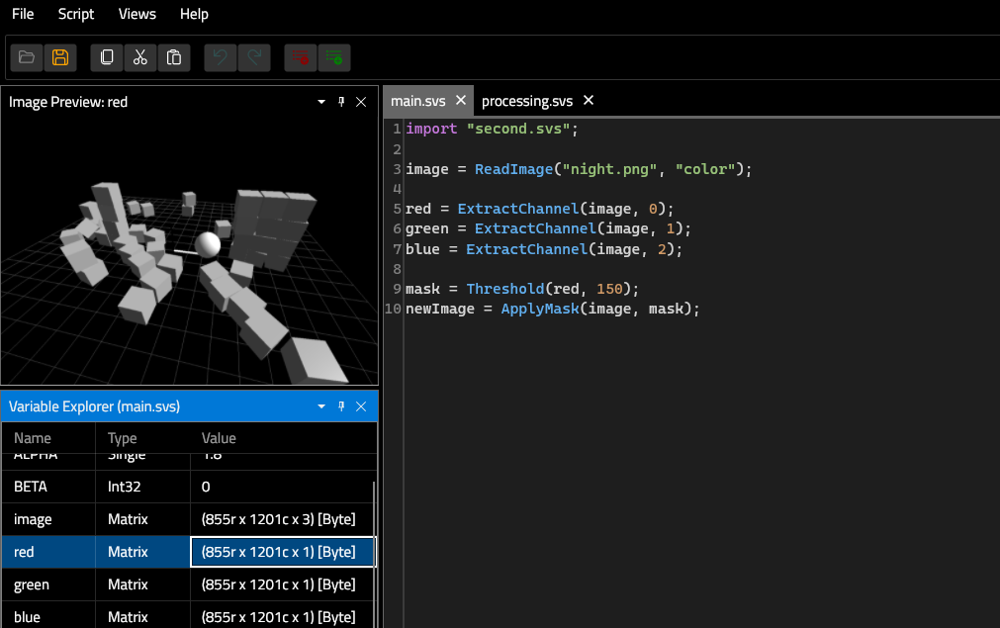
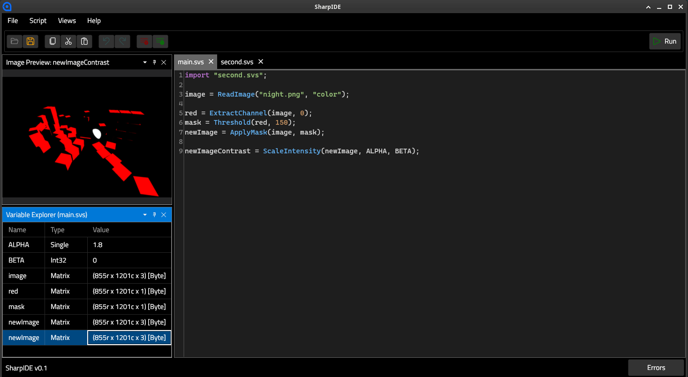
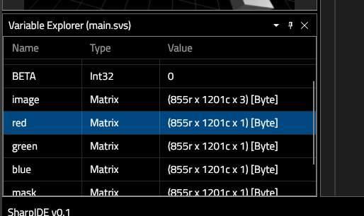
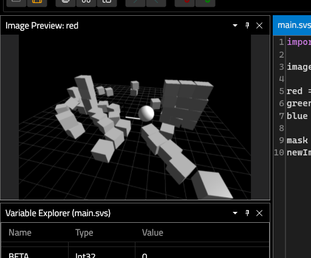
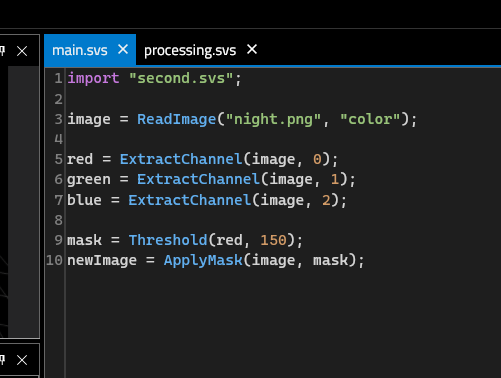
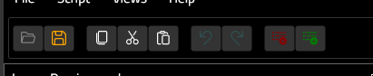
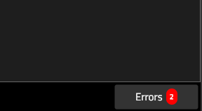
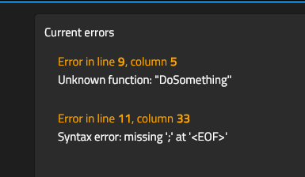

* SharpVision: Computer Vision Sandbox Built With C#

The SharpVision application stack consists of:
- SharpVision: A C# classlib containing CV algorithms
- Fishbone: an interpreted, dynamically-typed DSL used for quickly developing algorithms using SharpVision functions
- SharpIDE: a cross-platform GUI environment where you can develop using Fishbone

** SharpVision

The SharpVision library acts as the core engine of the project. It can be embedded as a standalone library for use in C#:

#+BEGIN_SRC csharp
  using SharpVision;

  Matrix<byte> image = new();
  Sharp.ReadImage(image, "Images/night.png", ReadMode.Color);

  Matrix<byte> imageHSI = new();
  Sharp.ConvertColor(image, imageHSI, ColorConversion.RGB2HSI);

  byte[] lower = [0, 200, 60];
  byte[] upper = [60, 255, 255];

  Matrix<byte> mask = new();
  Sharp.ThresholdRange(imageHSI, mask, lower, upper);

  Matrix<byte> output = new();
  Sharp.ApplyMask(image, output, mask);

  Sharp.SaveImage(output, Path.Combine(AppContext.BaseDirectory, "Output/night_mask.png"));
#+END_SRC

SharpVision currently includes around 20 operations involving matrix manipulation, color space transformation, masking operations and point operations.

The methods implemented in the library prioritize clarity over micro-optimizations. My intention for this project is to serve as a learning sandbox where users can experiment with the foundational algorithms of computer vision.

** Fishbone

Fishbone serves as a language for interfacing with the SharpVision algorithms in an easier and faster way. It's dynamically typed, which helps reduce a lot of boilerplate code:

#+BEGIN_SRC fishbone
let image = CreateMatrix();
let gray = CreateMatrix();
let mask = CreateMatrix();
let newImage = CreateMatrix();
let newImageContrast = CreateMatrix();

ReadImage(image, "night.png", "color");
ConvertColor(image, gray, "rgb2gray");
Threshold(gray, mask, 150);
ApplyMask(image, newImage, mask);
ScaleIntensity(newImage, newImageContrast, 1.25, 10);

SaveImage(newImageContrast, "night_output.png");
#+END_SRC

The function calls map directly to the SharpVision algorithm implementations.

Fishbone currently supports:
- declaring variables
- if/else if/else statements
- while statements
- matrix, int, float (single), string, true/false types
- comparison operators
- boolean operators (and, or, xor, not)
- break and continue

SharpVision exposes its script functions through a Fishbone configuration. Script calls use the same public SharpVision methods that C# callers use, with small adapter behavior for enum parsing, primitive conversion, and nested call unwrapping. Image-producing operations mutate caller-provided destination matrices so scripts can reuse allocations.

** SharpIDE

The SharpIDE provides a graphical interface where users can open/write Fishbone scripts and run them:

The project is being built with Avalonia and leverages existing tools like AvaloniaEdit and TextMate grammars to integrate Fishbone into the GUI environment.

*** Variable Explorer

The variable explorer allows you to see the values of the variables at the end of the script execution:

*** Image Preview

The image preview displays the currently selected image (~Matrix<byte>~) from the Variable Explorer:

*** Text Editor

The text editor is the area where you can input your scripts:

The toolbar includes helpful shortcuts for the text editor:

*** Error notifications

Errors may occur when trying to execute a script (like invalid number of parameters in a function call, identifiers not found, syntax errors, etc.). The error output section at the bottom will display this information (if any):

* How to run

(Windows 10/11 and Debian 12 (xfce))

** Using dotnet CLI

1. Clone this repository
2.
#+BEGIN_SRC python
  cd SharpIDE/
  dotnet run -c Release
#+END_SRC

** Using VisualStudio

1. Clone this repository
2. Open SharpVision.slnx in VisualStudio
3. Set the SharpIDE project as startup project and run

Note: to just use the sharpvision classlib, simply reference it directly from any project you want to use it from

* References

- The SharpVision algorithm implementations are based off the book /Digital Image Processing, Fourth Edition (2018)/ by Rafael C. Gonzalez and Richard E. Woods.
- The SharpVision library uses SixLabors.ImageSharp for image input/output operations.
